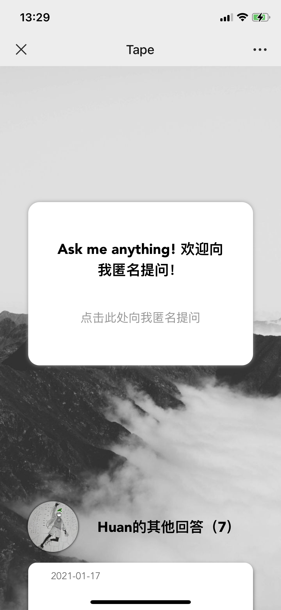
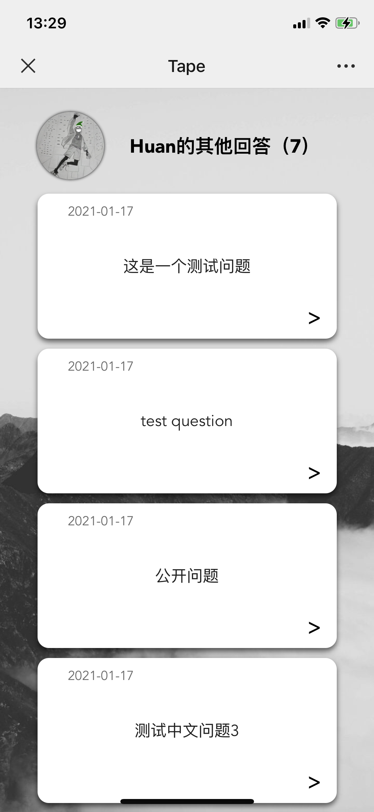
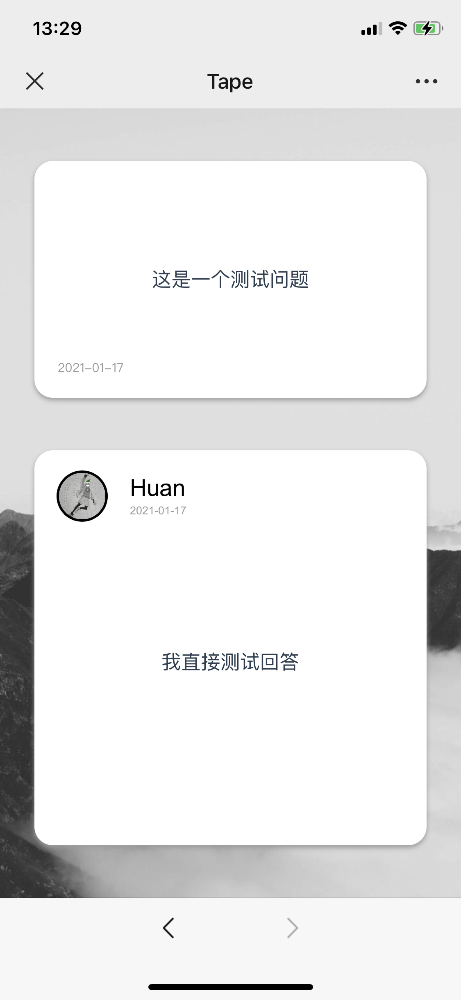
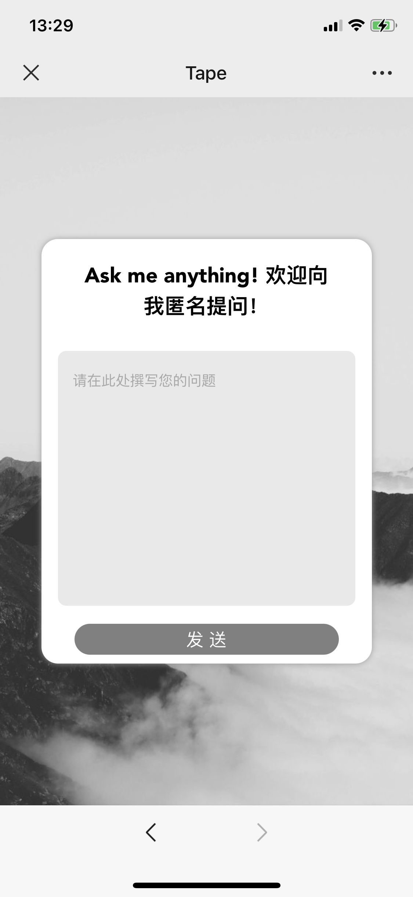
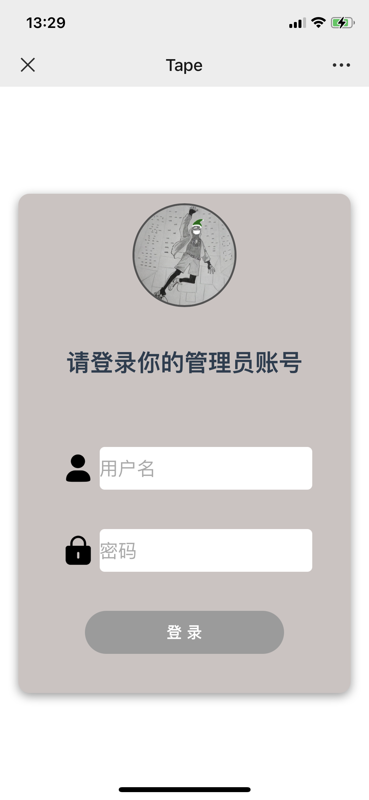
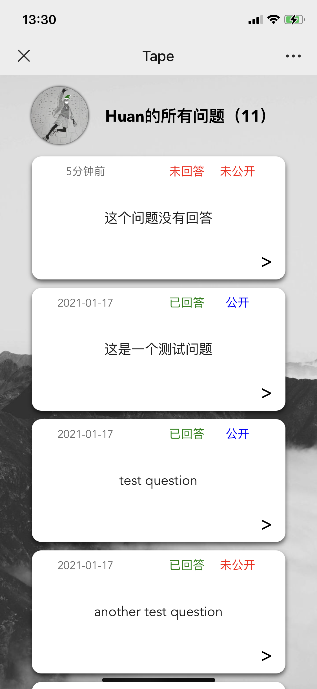
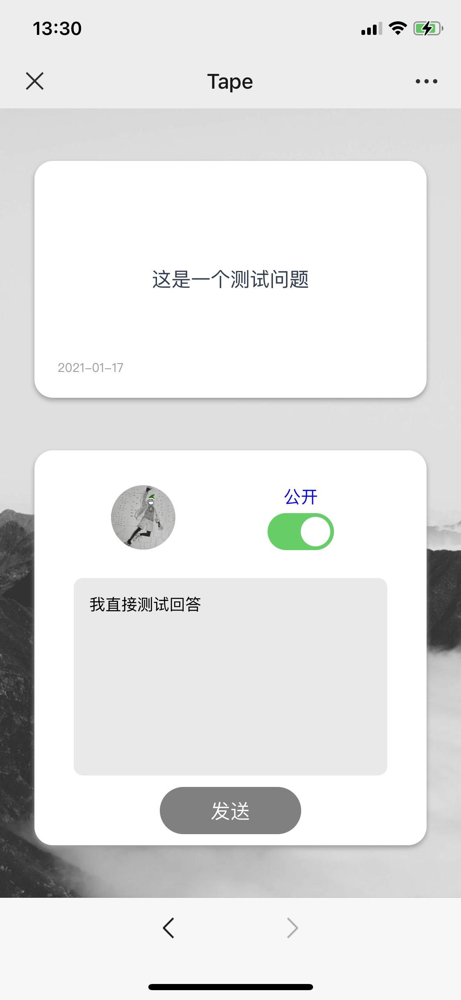

# tape

> :qatar: An anonymous ask & answer box

> My box is at [http://tape.thungghuan.xyz](http://tape.thungghuan.xyz), welcome to ask me anything and star this repository.

## Description

> Since I'm too lazy to download the [app](http://tapechat.net/) to make my own question box, I decide to make one myself...

### Application screenshots

* #### home page demo

<div style="width:80%; display: flex;">
    
    
    
    
</div>

* #### admin page demo

<div style="width:90%; display: flex;">
    
    
    
</div>


## Tech Stacks

* [Node.js](https://github.com/nodejs/node)

* [express](https://github.com/expressjs/express)
* [vue](https://github.com/vuejs/vue)
* [mongodb](https://github.com/mongodb/mongo)


## Installation

* ### [Install mongodb](https://docs.mongodb.com/manual/installation/) and run it first

```shell
mongod
```

* ### Clone this repository

```shell
git clone  https://github.com/Thungghuan/tape.git
cd tape
```

* ### Install dependencies

```shell
npm install
```

* ### Configure

	* Default  [configuration](./config/config.default.js) will be used
	
	* Use your own configuration
	
	
	```shell
	cp config/config.default.js config/config.js
	
	# use any editor to change configuration
	vim config/config.js
	```
	
	>server_port: back-end port, default 3000,
	>request_url: base url for front-end requests, default "http://localhost:3000",
	>mongodb_url: the url of mongodb in your server, default "mongodb://localhost:27017",
	>cross_resource_origin: your front-end address to set cros, default "http://localhost:8000",
	>session_secret: secret to create session in back-end server, default "keyboard cat",
	>user: {
	>    username: your admin username, default "admin",
	>    profile_url: your admin profile pic url, default "http://cdn.thungghuan.xyz/lzh-68888866.jpg",
	>    background_url: your page background image url, default
	>
	>​		 "https://pic1.zhimg.com/80/v2-6c5e3fcffd92c1149c28e1d075881043_720w.jpg?source=1940ef5c"
	>}


* ### Run and develop

#### Run back-end server

```shell
npm run server
```

#### Compiles and hot-reloads for front-end development

```shell
npm run serve
```

* ### Deploy

### Compiles and minifies for production

```shell
npm run build
```

> Since the project use Vue Router's history mode, for this single page client side app, without a proper server configuration, the users will get a 404 error if they access a child route directly in their browser.
>
> To fix the issue, all you need to do is add a simple catch-all fallback route to your server. [See this.](https://router.vuejs.org/guide/essentials/history-mode.html#example-server-configurations)	


## Usage

### For everyone:

* Everyone can visit the root page `/` to check all public questions
* To ask a question, click the button in the home page or visit `/ask`
* To check the answer of a question, click the tape of the question


### For admin:

* Visit admin page `/admin` for admin management.  For the first time, it will redirect to a register page `/register`, and then will redirect to the login page `/login`
* After signing up and signing in, it will finally redirect to admin page `/admin` and will show all questions, including those are not public and haven't answered yet
* To answer one question or to update the answer of on question, click the tape of the question


## Further development

> For further developing, maybe I'll add some more features.
>
> I call these 'To-do', but maybe I will never ever come back to achieve them :)

- [ ] Make it to be used by more users, not just one admin.
- [ ] Add a sub-question for every question, then someone can ask more about one topic.
- [ ] Inform the asker when the question is answered.
- [ ] Maybe Wechat Mini Program?

